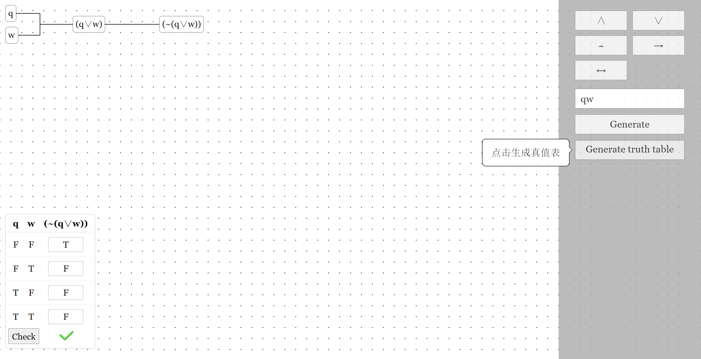

# FormalLogicJS 数理逻辑 JS

## 白嫖不分国界（？）

欢迎 star，欢迎 follow，支持一下非科班出身的 cou 弟弟。

## 前言

> 清华是一所好学校，北航也是一所好学校。
> —— 徐惠彬院士，于 2018 年北京航空航天大学本科生开学典礼

其实本人没学过数理逻辑，但是受好朋友的邀请，接了一个这么个横向的任务：“同学们在学习数理逻辑上会有困难，希望开发一个这样的平台能够帮助学习有困难的同学。”

呃，👴找了好久，整个 GitHub 上就没个数理逻辑的实验平台。算了算了自己动手写一写吧，写了好久的 jQuery，却被人劝退，但是👴觉得 jQuery 还是蛮好用的。

## 怎么用？

你可以 `clone` 下来自用，或者进入 about 区的链接进行尝试。

首先，要在输入框中输入变元，举例：如果需要变元 $a$ 和 $q$，那么就在输入栏输入 `aq`，再点击按钮 `Generate` 就行了。此时幕布上出现了 `a` 和 `q`，如图：

然后，你可以选择变元 $a$ 和（或）$q$（只要变红，就代表成功选中），然后点击右边的五种逻辑联结词（$\sim,\land,\vee,\rightarrow,\leftrightarrow$），就会得到表达式。

**注意**：只有在选择一个或两个变元（或表达式）时才能进行运算。只选中一个变元（或表达式）时，只能进行非运算（$\sim$），选中两个变元（或表达式）时，不能进行非运算。

最后，当你确定好表达式后，点击 `Generate Truth Table`，真值表就出现了。

这时，你可以进行做题，在真值表每行需要输入的地方输入你的答案，弄好了就选择 `Check`，就可以看到答案：

~~👴tql，~~做对啦！当然你也可以试一试。
